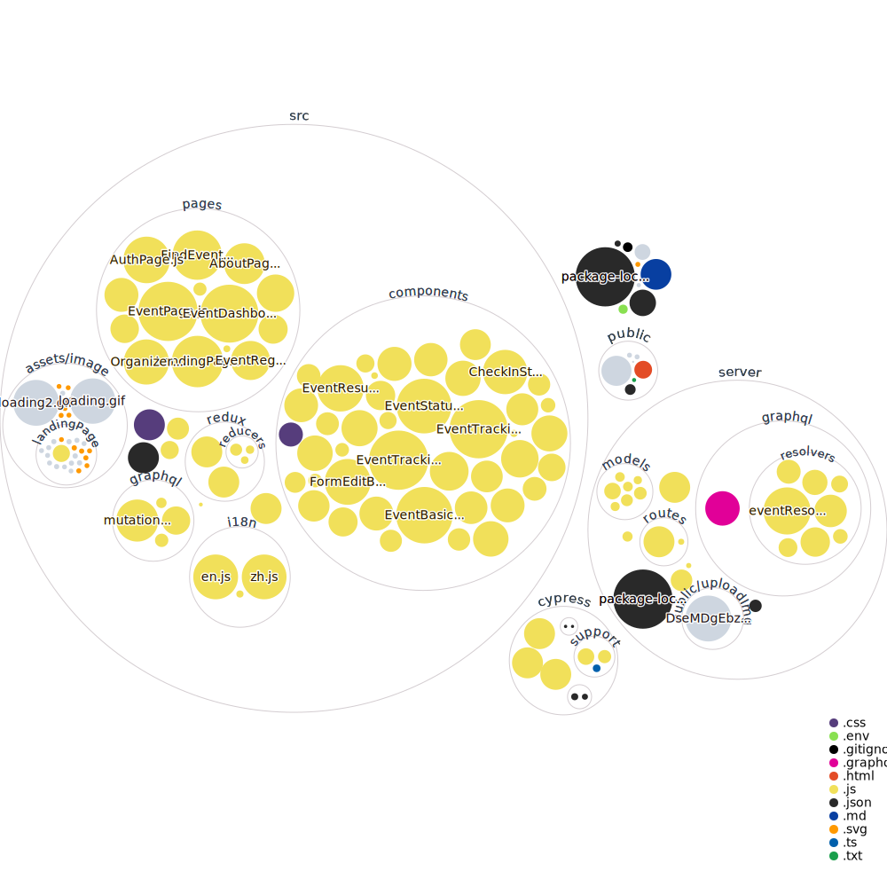

# Sportify

Sportify is a website for user to browse/host sport event.
- Website: [Sportify.live](www.sportify.live)
### Built With
- [React](https://reactjs.org/)
- [Node.js](https://nodejs.org/en/)
- [MongoDB](https://www.mongodb.com/)
- [GraphQL](https://graphql.org/)
- [Apollo](https://www.apollographql.com/)
- [Cypress](https://www.cypress.io/)
## Getting Started with Sportify

### Prerequisites
In order to start our app on your local machine, you must download dependencies with either ```npm``` or ```yarn``` .
  -  npm
  ```
    npm install npm@latest -g
  ```
  - yarn 
  ```
    npm install --global yarn
  ```
### Installation
Download our repo by using ```git``` command .
  ```
    git clone https://github.com/jeff0723/Sportify
  ```
After download our repo, make it as your working directory.
  ```
    cd Sportify
  ```
There is two way to start our project:
  1. Install client-side dependencies and server-side dependencies then start
  ```
    npm install
    cd server 
    npm install
  ```
  - start client 
  ```
    npm run start-client
  ```
  - start server 
  ```
    npm start
  ```
  Visit ```http://localhost:3000``` to use our app.
  
  2. Build and start
  - install
  ```
    npm install
  ```
  - build
  ```
    npm run build
  ```
  or 
  ```
    npm run build -- --profile
  ```
  if you want to enable profiling in the production build.
  - start 
  ``` 
    npm start
  ```
  Visit ```http://localhost:5000``` to use our app if you start it in this way.
  
### Testing

Sportify enable two kind of testing
1. End-to-end test
2. Component test


#### End-to-end test

  Add file to ```cypress/integration``` directory with ```*.spec.js``` as file name.

  Run ```npm run cy:open``` if you want to start a interactive mode or run ```npm run cy:run``` if you want to run tests directly.

- Options 

  Run in build/unbuild mode use ```npm run cy:open | cy:run -- --env configFile=build | unbuild```


#### Component test 
  
  To test particular component, you can add file in ```src``` directory with ```<ComponentName>.test.js``` as file name.

  Run ```npx cypress open-ct``` to open interactive mode or ```npx cypress run-ct``` to run tests directly.


# Repo Visualizer

We've included the generated diagram of our project structure into README:




## Learn More

You can learn more in the [Create React App documentation](https://facebook.github.io/create-react-app/docs/getting-started).

To learn React, check out the [React documentation](https://reactjs.org/).

### Code Splitting

This section has moved here: [https://facebook.github.io/create-react-app/docs/code-splitting](https://facebook.github.io/create-react-app/docs/code-splitting)

### Analyzing the Bundle Size

This section has moved here: [https://facebook.github.io/create-react-app/docs/analyzing-the-bundle-size](https://facebook.github.io/create-react-app/docs/analyzing-the-bundle-size)

### Making a Progressive Web App

This section has moved here: [https://facebook.github.io/create-react-app/docs/making-a-progressive-web-app](https://facebook.github.io/create-react-app/docs/making-a-progressive-web-app)

### Advanced Configuration

This section has moved here: [https://facebook.github.io/create-react-app/docs/advanced-configuration](https://facebook.github.io/create-react-app/docs/advanced-configuration)

### Deployment

This section has moved here: [https://facebook.github.io/create-react-app/docs/deployment](https://facebook.github.io/create-react-app/docs/deployment)

### `npm run build` fails to minify

This section has moved here: [https://facebook.github.io/create-react-app/docs/troubleshooting#npm-run-build-fails-to-minify](https://facebook.github.io/create-react-app/docs/troubleshooting#npm-run-build-fails-to-minify)


<!-- LICENSE -->
## License

Distributed under the MIT License. See `LICENSE` for more information.


<!-- CONTACT -->
## Contact

Jeffrey Lin - [@qwertzxc1478963](https://twitter.com/qwertzxc1478963) - jeffreylin0723@gmail.com
